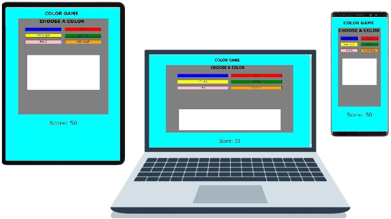
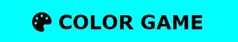
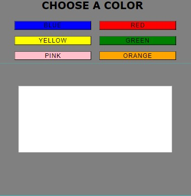
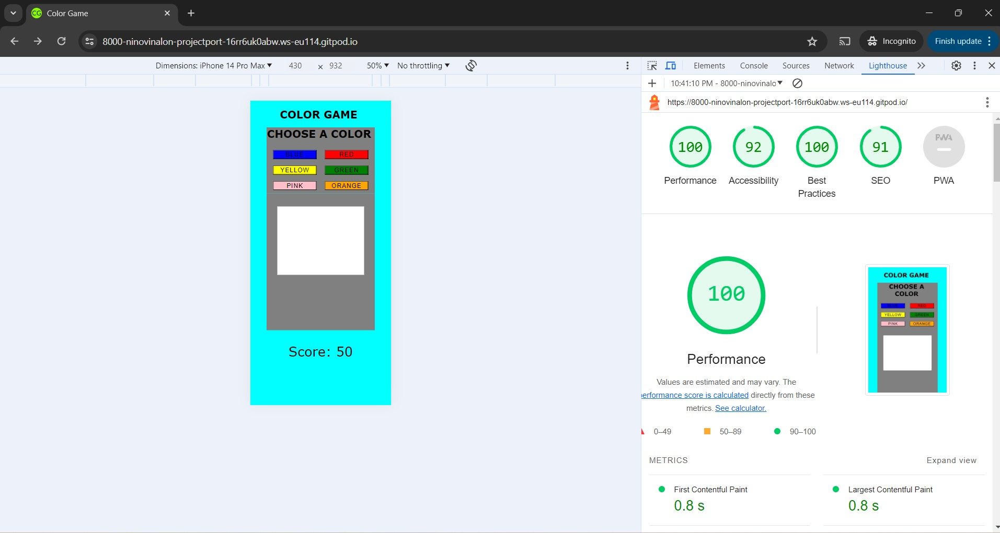

# COLOR GAME

Visit the website [Here](https://ninovinalon.github.io/project-portfolio-2/)

The Color Game is a simple yet innovative game that people of all age will enjoy. The site will target
anyone from toddlers who are at home enjoying their tablet/ipad to people working in the office looking to
take a break from few minutes from their dreadful day.

The game itself requires no complex action to function. Players only need to pick and guess any color
that game board might display. At the start of the game, the player will be given 50 points. Any correct
guess will merit 50 points and a deduction of 10 points for any incorrect guess.

## Features

The game features simple design, there are buttons that corresponds to each color available for player to
choose on and the game board on where the correct color will be displayed. The score board is
displayed at the bottom of the page.

### Existing Features

- **The Color Game Logo and Heading**
    - Featured at the top of the page, the Love Maths logo and heading is easy to see for the user. Upon viewing the page, the user will be able to see the name of the game.

        

- **The Game Area**
    - The user has the option to choose the color in this section. There are 6 colors to choose from: blue, red, yellow, green, pink, and orange. You will also see the color box which will show which color the computer chooses from the 6 colors.

        

- **The Score Area**
    - This section is where you will find the score and it will change to "Game Over" once the score goes down to zero.

        

## Testing

    - The game was tested using a laptop, Samsung S23 Ultra, iPhone 13 Pro Max, and iPad. 
    - I tested playing this game in different browsers: Chrome, Firefox and Safari.
    - The game runs smoothly and no problems occurred.
    - The game results are always correct.
    - I make sure that the rules are easy to understand.
    - I confirmed that the colors and fonts chosen are easy to read and accessible  
    by running it through lighthouse in devtools.

        

### Validator Testing

- **HTML**
    - No errors were returned when passing through the [official W3C validator](https://validator.w3.org/).

- **CSS**
    - No errors were found when passing through the [official (Jigsaw) validator](https://jigsaw.w3.org/css-validator/).

- **Javascript**
    - No errors were found when passing through the [official JSHint JavaScript Validator](https://jshint.com/)

    - There are 5 functions in this file.
    - Function with the largest signature take 1 arguments, while the median is 0.
    - Largest function has 15 statements in it, while the median is 8.
    - The most complex function has a cyclomatic complexity value of 3 while the median is 2.

### Unfixed Bugs

    No unfixed bugs.
